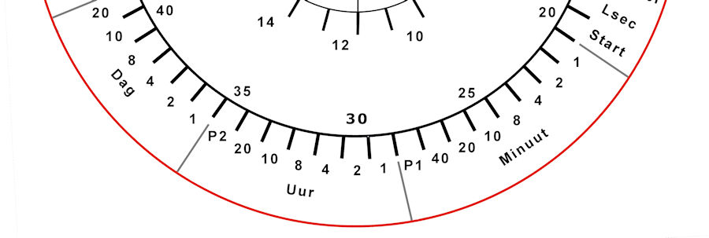

# DCF77 HC-12 Bluetooth transceiver clock

<table  border="0">
  <tr>
    <td></td>
    <td>
	</td>
  </tr>
  <tr class="auto-style1">
    <td>Front (The colours of the LEDs are in real much more vivid) </td>
    <td>Inside the clock (3:55 hours later)  
    The DCF77-receiver hangs 10 cm away from the signal interfering LEDs and segment displays</td>
  </tr>
</table>

<strong>Introduction </strong>

This clock <a href="https://www.dcf77logs.de/live">decodes the DCF77-signal</a>, displays the received DCF77 bits and various information parameters in three WS2812 RGB-rings. 
  After decoding it sends the time as a string into the ether with a HC-12 433MHz Wireless Serial Transceiver. 
  with a Bluetooth module the clock can be controlled and statistics about the received signals retrieved 
   
  The time is displayed with a 4-digit 7-segment
  HK16K33 and a 4-digit 7-segment
  I2C-TM1637  display. 
  (I prefer the TM1637 displays but bought the by accident HK16K33 displays.)  
  The received or calculated information is displayed with MAX7219 8-digits 7-segment displays.  
   
  The software makes use of an algorithm that collects the readings without using interrupts (DCFNoInt) in contrast with the DCF77 Arduino library that uses interrupt to detect a pulse change.  
  In this DCFNoInt-program the processor is able to collect, in it spare time, over 30,000 
low or high signals. 
  In Mainflingen, Germany, a transmitter send on the long wave frequency of 77.5 KHz 
a signal that can be on or off (high or low).  
  Every second the signal is on for 0.1 second or 0.2 second.
That translates in respectively a 0 or 1 bit.  
The time is decoded in a <a href="https://en.wikipedia.org/wiki/Binary-coded_decimal">binary-coded decimal</a> format as shown in the picture below. 

 
   
  The DCFNoInt-algorithm is sensitive for long delays() in the code. The sample program demonstrates a method to avoid delays.  
  An advantage of this non-interrupt method is it smoothens spikes in the signal and does not require filtering because it takes an average of the received positive pulses.  
  Not all programs can be made 'uninterruptable' without long delays . Time consuming subroutines can make the pulse readings 
less usable. 
  The menu contains an option to read the pulses every x msec for y msec long. By playing with the x and y values the readings may be 
optimized for a program with long running subroutines.  

<table border="0" style="width: 628px">
  <tr>
    <td width="676" class="auto-style3">
	</td>
  </tr>
  <tr>
    <td>It is also possible to make a smaller unit with a 24 LED ring and a HC-12 transceiver. 
	<a>See </a> 
	<a href="https://github.com/ednieuw/DCF77_HC12">here 
	how</a> to make this receiver or modify this newer program V055 used for this 
	DCF77-transceiver. </td>
  </tr>
</table>

  The efficiency of the NoInt-method is comparable with the DCF77-library in the Arduino IDE from Thijs Ellenbaas.  
  With good reception both methods decode over 99%.  
  When reception is worse it depends on the signal. Sometimes the DCFNoInt-routine outperforms the interrupt routine by 50%. 
  The interrupt and non-interrupt methods are both used together in this program and increases the efficiency even further. 
In this program both received times must be identical before it is written to the optional RTC-module or internal Arduino clock. 

<table width="916" border="0">
  <tr>
    <td width="6">&nbsp;</td>
    <td width="900" class="auto-style1">

		
</td>
  </tr>
  <tr>
    <td>&nbsp;</td>
    <td class="auto-style1">This is the result of a DCF77 receiver 5 cm away from WS2812 LEDs .  
    These LEDs  (but also the 7-segment displays) interferes the reception of the signal. From the 20365 minutes the original Arduino library (Th:) receives 5026 (25%) date/times correctly. The non interrupt 
	algorithm (Ed:) decodes 9263 (45%) times the date/time. EdT: are the 1682 proper times but not proper dates received. </td>
  </tr>
  <tr>
    <td>&nbsp;</td>
    <td class="auto-style1">Combined the proper received times exceeded 75% (not shown). That is 3 times better. 
	 </td>
  </tr>
</table>

  
  <strong>The Program</strong>

By turning on or off the #defines with a // in the program, one or both methods can be used.

<pre class="style3">#define DCFMOD       // Use the Arduino DCF77 library with interrupts.
#define DCFTINY      // Use the DCFNoInt DCF algorithm in this program.
 </pre>
This is the heart of the algoritm; just counting the 
positive signals and the total received signals. 
 <pre class="style3"> SumSecondSignal += (!digitalRead(DCF_PIN));      // invert 0 to 1 and 1 to 0
 SumSignalCounts++;
    </pre>

After 995 milliseconds it waits for the positive signal to drop to zero.  
  

<pre class="style3">if((millis() - DCFmsTick) &gt;995))     // Compute every second the received DCF-bit to a time 
 { 
 while (1-digitalRead(DCF_PIN))     // Avoid splitting a positive signal 
  {
   SumSignalCounts++;
   SumSecondSignal++;
  } </pre>

These few lines took  weeks of experimenting and solve why it lost every few minutes a good reception of the time. 
The internal Arduino clock drifts more than expected. 1 second in less than 10 minutes. 
In line 848 there is a correction possibility to make the calculation of the 
pulse percentage close to 10% and 20%. The signal length can be seen in the 
serial monitor or Bluetooth connection with option A from the menu and of course 
on the clock it self.  &nbsp;SumSignalCounts*=1.10;&nbsp;&nbsp;&nbsp;&nbsp; 
// Correction to correct pulses to an average of 100 and 200 msecs

When the signal is decoded in line 913 a signal length 
between 5.1 and 16% is a 0 bit and between 16% and 32% a 1 bit. No signal for 
a second is the start of a new minute and all other signal lengths are an error.
 

<pre>int msec  = (int)(1000 * SumSecondSignal / SumSignalCounts);                  // This are roughly the milliseconds times 10 of the signal length
 switch(msec)
  {
   case   0 ...  10: if (SumSignalCounts &gt; 50)                                 // Check if there were enough signals
                       {Bitpos = 59; Receivebitinfo = 2; Receivebit = 0; }     // If enough signals and one second no signal found. This is position zero
                              else { Receivebitinfo = 9; Receivebit = 0; }     // If not it is a bad signal probably a zero bit
                                                                        break; // If signal is less than 0.05 sec long than it is the start of minute signal
   case  11 ...  50: Receivebitinfo = 8; Receivebit = 0;                break; // In all other cases it is an error
   case  51 ... 160: Receivebitinfo = 0; Receivebit = 0;                break; // If signal is 0.1 sec long than it is a 0 
   case 161 ... 320: Receivebitinfo = 1; Receivebit = 1;                break; // If signal is 0.2 sec long than it is a 1 
   default:          Receivebitinfo = 9; Receivebit = 1;                break; // In all other cases it is an error probably a one bit
  }</pre>

Errors are flagged in the Receivebitinfo and the flag 
TimeSignaldoubtfull is set. When set the time/date is not reported.  The 
decoding routine returns TimeOk = 5 as result.  When TimeOK = 1 then the Date 
and time are correct. When TimeOk = 2 the date is possibly wrong but the time is 
OK and differs less than 2 minutes from the previous received time.

Statistics are stored into EEPROM once a day at 0:00.  
Statistics can be seen from the menu with option S

&nbsp;

When A is pressed in the menu every second this line is 
printed

<pre>@MH. 4181 36100 11% (0) 14:42:47 05-01-2000/6 F1 Ed:10943 Th:11094 Min:11717 OK:0 L:Y
@MH. 8905 37769 23% (1) 14:42:48 05-09-2000/6 F1 Ed:10943 Th:11094 Min:11717 OK:0 L:Y
@MH. 4095 36086 11% (0) 14:42:49 05-09-2000/6 F1 Ed:10943 Th:11094 Min:11717 OK:0 L:Y
@MH. 4286 36099 11% (0) 14:42:50 05-09-2000/6 F1 Ed:10943 Th:11094 Min:11717 OK:0 L:Y
@MH. 4424 36059 12% (0) 14:42:51 05-09-2000/6 F1 Ed:10943 Th:11094 Min:11717 OK:0 L:Y
@MH. 4150 36099 11% (0) 14:42:52 05-09-2000/6 F1 Ed:10943 Th:11094 Min:11717 OK:0 L:Y
@MH. 3992 36100 11% (0) 14:42:53 05-09-2000/6 F1 Ed:10943 Th:11094 Min:11717 OK:0 L:Y
@MH. 3831 36058 10% (0) 14:42:54 05-09-2000/6 F1 Ed:10943 Th:11094 Min:11717 OK:0 L:Y
@MH. 9440 38493 24% (1) 14:42:55 05-09-2020/6 F1 Ed:10943 Th:11094 Min:11717 OK:0 L:Y
@MH. 3783 36051 10% (0) 14:42:56 05-09-2020/6 F1 Ed:10943 Th:11094 Min:11717 OK:0 L:Y
a</pre>
When S is pressed<pre>s
----&gt; Statistics -----
DCFEd:10943                  <strong>DCFNoInt algorithm</strong> 
DCF77:11094                  <strong>DCF Arduino library</strong> 
Both:10537                   <strong>Identical time at the same minute </strong>
Valid times:11474            <strong>Valid times receive with both algorithms</strong> 
Total minutes:11717          <strong>Total time running</strong>
DCF Eff:97% Signal:99 DCF    <strong>Valid times in % and consecutive good minutes received (0-99) </strong>
0  1  2  3  4  5  6  7  8  9  10 11 12 13 14 15 16 17 18 19 20 21 22 23 -- Hour
60 60 60 60 60 60 58 60 58 60 56 58 58 54 60 60 58 60 56 58 58 53 60 55 <strong>-- Valid times NoInt</strong>
60 60 60 60 60 60 60 60 59 60 54 47 60 55 60 60 60 58 58 58 60 54 60 60 <strong>-- Valid times Int</strong>
03 03 04 03 03 05 00 03 04 02 03 07 03 17 01 01 02 05 03 01 03 02 02 03 <strong>-- Signal faults</strong>
1  2  3  4  5  6  7  8  9  10 11 12 13 14 15 16 17 18 19 20 21 22 23 24 25 26 27 28 29 30 31
56 57 57 57 00 00 00 00 00 00 00 00 00 00 00 00 00 00 00 00 00 00 00 00 00 00 00 00 00 00 00 
57 58 58 58 00 00 00 00 00 00 00 00 00 00 00 00 00 00 00 00 00 00 00 00 00 00 00 00 00 00 00 
05 03 03 02 00 00 00 00 00 00 00 00 00 00 00 00 00 00 00 00 00 00 00 00 00 00 00 00 00 00 00 
1  2  3  4  5  6  7  8  9  10 11 12
00 00 00 00 00 00 00 54 00 00 00 00 
00 00 00 00 00 00 00 55 00 00 00 00 
00 00 00 00 00 00 00 19 00 00 00 00 
0  1  2  3  4  5  6  7  8  9    Last 10 years (year modulo 10)
00 00 00 00 00 00 00 00 00 00 
00 00 00 00 00 00 00 00 00 00 
00 00 00 00 00 00 00 00 00 00 </pre>
<pre>
  DCF77 Lib OK --&gt; 14:42 05-09-2020                       <strong>The Arduino library decode a date/time</strong> 
TIME &amp; DATE OK --&gt; 14:42 05-09-2020                       <strong>The DCFNoInt algorithm decode a date/time</strong>
@L001|14:42:01 05-09-2020|DCF-eff:97% Signal:99 |DCF      <strong>Line sent with the HC-12</strong>
T144202                                                   <strong>Line sent with HC-12 to set time in my clocks</strong></pre>

After two years statistics are:

<pre>----&gt; Statistics -----
DCFEd:855591
DCF77:785000
Both:759415
Valid times:878673
Total minutes:1006933
DCF Eff:87% Signal:99 DCF
0  1  2  3  4  5  6  7  8  9  10 11 12 13 14 15 16 17 18 19 20 21 22 23&nbsp;
60 58 58 58 60 56 60 60 58 60 58 60 60 54 56 58 60 60 56 58 00 00 00 42&nbsp;
60 60 60 60 60 60 60 60 60 60 60 60 60 60 60 60 60 60 60 60 00 00 00 43&nbsp;
02 04 02 03 01 03 04 00 05 00 04 02 05 03 02 01 03 04 03 02 00 00 00 03&nbsp;
1  2  3  4  5  6  7  8  9  10 11 12 13 14 15 16 17 18 19 20 21 22 23 24 25 26 27 28 29 30 31
58 59 58 58 57 56 42 00 00 00 00 00 00 00 00 00 00 00 00 00 00 00 00 00 00 00 00 00 00 00 00&nbsp;
59 60 59 59 59 57 43 00 00 00 00 00 00 00 00 00 00 00 00 00 00 00 00 00 00 00 00 00 00 00 00&nbsp;
03 02 03 02 02 05 03 00 00 00 00 00 00 00 00 00 00 00 00 00 00 00 00 00 00 00 00 00 00 00 00&nbsp;
1  2  3  4  5  6  7  8  9  10 11 12
57 56 57 57 57 57 57 58 58 56 56 56&nbsp;
57 52 48 57 57 58 58 58 58 55 56 56&nbsp;
07 08 07 05 08 04 06 06 03 07 05 08&nbsp;
&nbsp;0  1  2  3  4  5  6  7  8  9    Last 10 years (year modulo 10)
08 52 56 00 00 00 00 00 00 00&nbsp;
57 56 55 00 00 00 00 00 00 00&nbsp;
15 09 10 00 00 00 00 00 00 00&nbsp;</pre>

The DCF77 algorithm stopped working for some time and has 
a slightly lower score. After a restart of the clock the system worked again. 
Yesterday around 23h the MAX7219 display did not react anymore and a power down 
was needed.

&nbsp;

<strong>The LEDs and Display</strong>

<table cellpadding="0" style="width: 640px">
	<tr>
		<td class="auto-style1" style="width: 644px">The DCFNoInt (DCFTINY in the define) algorithm was developed to drive the LEDs of the clock.  
  The clock contains three rings of 8, 24 and 60 LEDs.  
  The outer ring displays the received bits per minute. blue = 0 and red = 1.  
  The middle ring display the signal efficiency per hour and the current hour with a white LED.  
  The inner ring displays various parameters. </td>
		<td>
		</td>
	</tr>
	<tr>
		<td colspan="2"></td>
	</tr>
	<tr>
		<td class="auto-style1" colspan="2">Dutch design of the front display. I printed it on paper and placed it before the LEDs.</td>
	</tr>
</table>

  A TM1637 or HT16K33 display shows the current time.  
  A MAX7219 display is used to show the pulse width in msec, and the time as it is decoded by the algorithm  
  and the decoding efficiency in time as a percentage.  In the first seconds 
it displays the valid received times and total minutes it is running and then 
the date as 'ddmm' After 20 seconds the right four digits are the bit 
received by the LDR that controls the light intensity of the LEDs. So a lot 
of info and changing digits.

  The time is transmitted at 433 MHz with a HC12 transceiver 
module. The HC-12 can replace a Bluetooth module. They use the same baud rate 
of 9600 bps. Only the RX and TX lines are switched.  The coding to get the 
received characters from the module is identical.  &nbsp; 
  With a Bluetooth module connected the DCF77 clock can be operated with a phone.
 Search for "BLE HM-10 Terminal serial" for programs in the app stores of the 
phone On a PC/laptop with Bluetooth a connection can also be set up.

<strong>The Menu</strong>

The menu is as below and can be printed when entering the I in the serial monitor of the Arduino IDE 
or on a phone when connected with the Bluetooth module. 

 *** DCF HC12 Bluetooth Transmitter ***  
Enter time as: Thhmmss (T132145)  
A&nbsp; DCF debug info On/Off  
B&nbsp; Short DCF debug info On/Off  
C&nbsp; Clear statistics  
E&nbsp; Reset MAX7219  
F&nbsp; Toggle full or interval DCFtiny readings  
G&nbsp; (G20) DCF loop measures every (0-999) msec  
H&nbsp; (H50) measurements in DCF loop (0-999)  
I&nbsp; For this info  
K&nbsp; Toggle HC12 transmission ON/OFF  
Lnn (L5) Min light intensity ( 1-255)  
Mnn (M90)Max light intensity (1%-250%)  
N&nbsp; (N2208)Turn On/OFF LEDs between Nhhhh  
O&nbsp; Turn Display ON/OFF  
R&nbsp; Reset  
S&nbsp; Print statistics 
------------------------------------------ 
 
&nbsp; &nbsp; Ed Nieuwenhuys sep-2020  
&nbsp; Brightness Min:&nbsp; 4 bits Max:&nbsp; 15%  
&nbsp; &nbsp; LDR read Min:&nbsp; 0 bits Max: 187 bits  
&nbsp; DCF loop every:&nbsp; 5 msec&nbsp; for:&nbsp; 25 times  
LEDs off between: 22 - 08  
------------------------------------------
 
Software version: V055 Station: L001  
16:42:41 01-09-2020 

&nbsp;

<strong>The Electronics</strong>

An Arduino Nano Every is used to run the program.  
  Sketch uses 35859 bytes (72%) of program storage space. Maximum is 49152 bytes. 
  Global variables use 1553 bytes (25%) of dynamic memory, leaving 4591 bytes for local variables. Maximum is 6144 bytes. 

<table width="200" border="0">
  <tr class="auto-style1">
    <td colspan="2"></td>
  </tr>
  <tr class="auto-style1">
    <td width="298"><a href="Etcetera/Colour%2520Word%2520Clock%2520PCBV14.fzz">Fritzing design</a> of the PCB. </td>
    <td width="298">&nbsp;</td>
  </tr>
  <tr class="auto-style1">
    <td colspan="2">
&nbsp;
    </td>
  </tr>
</table>

The parts are connected to a PCB (designed for my 
Fibonacci and colour clocks).  
  A voltage divider with the 2.2 kOhm and 1.1 kOhm resistors lowers to voltage from 5V to 3.3V for the Bluetooth module 
The 470 Ohm resistors are used between the two LEDs and between the signal line of the WS2812 LEDs and the processor. 
The 22 kOhm resistor gives good results with the GL5528 LDR photo resistor. 
A 1000 uF capacitor protects the circuit and the WS2812 LEDs against power spikes. 
There is no need for a rotary decoder and these pins are used to connect the TM1637 display.

<pre class="style3">

The following pins are connected:
     // Digital hardware constants 

 DCF_PIN       = 2,  // DCFPulse on interrupt pin
 CLK_TM1637    = 3,  // PIN 3 TM1637Display
 DIO_TM1637    = 4,  // PIN 4 TM1637Display
 LED_PIN       = 5,  // LED rings on pin PIN 5
 BT_TX         = 6,  // Rx-pin on BT-mod to TX-pin on Arduino
 BT_RX         = 7,  // Tx-pin on BT-mod to RX-pin on Arduino 
 HC_12TX       = 8,  // RXD on HC-12 to TX Pin on Arduino 
 HC_12RX       = 9,  // TXD on HC-12 to RX Pin on Arduino
 MAX7219CLK    = 10, // MAX7219CLK
 MAX7219CS     = 11, // MAX7219CS 
 MAX7219DataIn = 12, // MAX7219DataIn
 DCF_LED_Pin   = 13  // Show DCF-signal
 };
 // Analog hardware constants ----
 EmptyA0       = 0, // A0
 EmptyA1       = 1, // A1
 PhotoCellPin  = 2, // A2 LDR
 EmptyA3       = 3, // A3
 SDA_pin       = 4, // SDA I2C pin for HT16K33 time display and DS3231 RTC clock module
 SCL_pin       = 5, // SCL I2C pin for HT16K33 time display and DS3231 RTC clock module
 EmptyA6       = 6, // Empty
 EmptyA7       = 7  // Empty </pre>

&nbsp;

 
  More info about clocks and DCF77 here:  
  <a href="https://ednieuw.home.xs4all.nl/Woordklok/index.html">https://ednieuw.home.xs4all.nl/Woordklok/index.html </a> 

Ed Nieuwenhuys 
  13 September 2022  

&nbsp;

